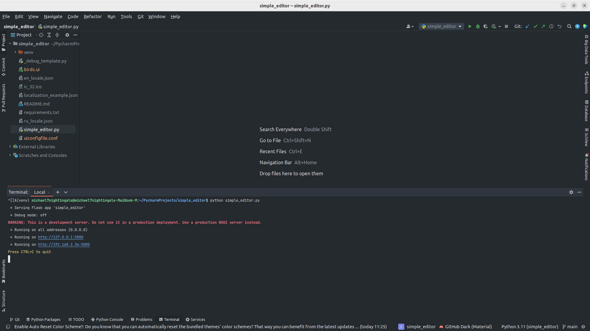
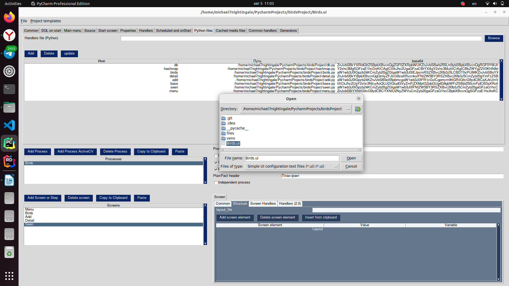
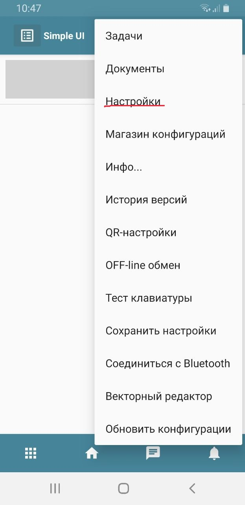
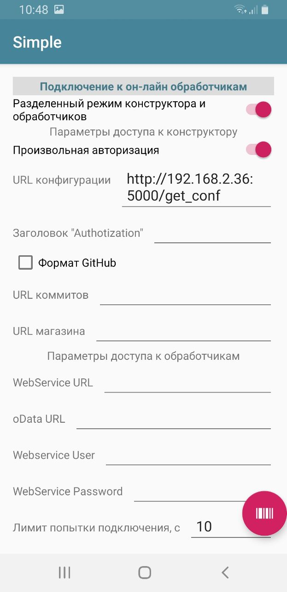

# Birds android application (Job test task)

This is the Python configuration for `Simple UI` framework. The business task is to create the process (application)
for managing the list of birds, their cards and your own seen list. I choose the most comfortable DB structure.


## Stack
- `Python 3.11`;
- `Simple UI` framework for building Android applications (https://uitxt.readthedocs.io/ru/latest/index.html);
- `Pony ORM` with SQLite;


## Requirements
If you want to modify project and run some parts locally, you should install python requirements.

NOTE!: Don't use select() generator Pony expression with Python 3.11, use model classmethod select() instead.
```commandline
pip install -r requirements.txt
```

## Running
### 1) Constructor.
First clone `Simple UI Constriuctor`  repository from https://github.com/dvdocumentation/simple_editor and run constructor application (simple_editor.exe is not comparable with Linux, personally for me).
```commandline
python simple_editor.py
```

Then you shall see two url in the terminal, you need the last one
(http://192.168.2.36:5000 for me).


Then open your configuration file.



### 2) APK.
Download APK file from https://disk.yandex.ru/d/wP07qs_nHARe0A. Install it on you mobile app, go to the settings and type into your configuration url.

 

Reload your application and use it!